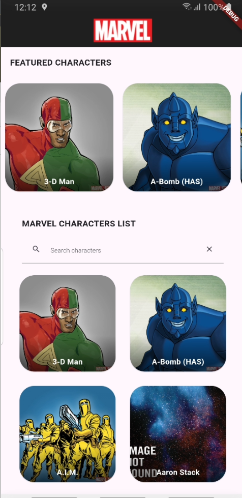

# Superherois Um aplicativo Flutter para descobrir e explorar seus super-heróis favoritos da Marvel.

## Descrição

O aplicativo Superherois permite que os usuários naveguem por uma vasta coleção de super-heróis da Marvel, visualizem seus detalhes, incluindo histórias, poderes e eventos relacionados. O aplicativo foi desenvolvidocom foco em uma arquitetura limpa e modular, utilizando boas práticas de desenvolvimento Flutter.

## Funcionalidades

- **Navegação por Super-heróis:** Explore uma lista completa de super-heróis da Marvel.
- **Visualização de Detalhes:** Acesse informações detalhadas sobre cada super-herói, incluindo descrição, histórias em quadrinhos, séries, eventos e links externos.
- **Pesquisa:** Encontre seus heróis favoritos usando a funcionalidade de pesquisa.
- **Favoritos:** Marque seus super-heróis favoritos para acesso rápido.
- **Compartilhamento:** Compartilhe informações de super-heróis com seus amigos (Em Desenvolvimento).

## Demonstração

[]

## Arquitetura

O aplicativo Superherois foi construído usando uma arquitetura modular e escalável, com foco na separação de responsabilidades e na testabilidade.

**Principais camadas:**

- **Apresentação:** Responsável pela interface do usuário e interação do usuário. Utiliza o padrão BLoC (Business Logic Component) para gerenciar o estado da aplicação.
- **Domínio:** Contém a lógica de negócio do aplicativo, independente da interface do usuário ou de infraestrutura.
- **Dados:** Responsável por acessar e gerenciar os dados do aplicativo, incluindo fontes de dados remotas (API da Marvel) e locais (banco de dados).

**Bibliotecas e tecnologias:**

- Flutter: Framework para desenvolvimento de aplicativos multiplataforma.
- Dart: Linguagem de programação usada pelo Flutter.
- ValueNotifier: Para gerenciamento de estado.
- http: Cliente HTTP para fazer requisições à API da Marvel.
- Mockito: Framework para mocking em testes unitários.
- Equatable: Package para simplificar a comparação de objetos em testes.
- Firebase Analytics:Para coletar dados de uso do aplicativo.
- MethodChannel: Para integrar o Firebase Analytics no código nativo.

## Começando

Para executar o aplicativo localmente, siga estas etapas:

1. Clone este repositório: `git clone https://github.com/seu-usuario/superherois.git`
2. Navegue até o diretório do projeto: `cd superherois`
3. Instale as dependências: `flutter pub get`
4. Execute o aplicativo: `flutter run`

**Configuração da API da Marvel:**

1. Obtenha uma chave de API da Marvel: [https://developer.marvel.com/](https://developer.marvel.com/)
2. Crie um arquivo `lib/env.dart` e defina as suas chaves de API:

## Testes

O aplicativo inclui testes unitários e de integração para garantir a qualidade do código. Para executar os testes, use o seguinte comando: 
flutter test

## Contribuindo

Contribuições são bem-vindas! Se você deseja contribuir com este projeto, siga estas etapas:

1. Faça um fork do repositório.
2. Crie uma branch para sua feature: `git checkout -b feature/nome-da-feature`
3. Faça suas alterações e commit: `git commit -m "Descrição das alterações"`
4. Faça push para sua branch: `git push origin feature/nome-da-feature`
5. Abra um Pull Request.

## Licença

Este projeto está licenciado sob a licença MIT - veja o arquivo [LICENSE](LICENSE) para mais detalhes.
